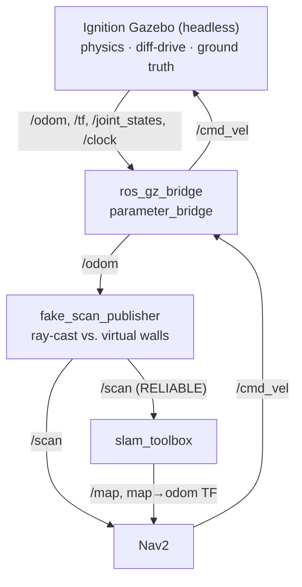

# ros-maze-solver

A ROS 2 Humble workspace for a differential-drive maze-solving robot (TurtleBot3 Burger)
in Ignition Gazebo, built up from teleoperation through wall-following, SLAM, and Nav2
autonomous navigation.

Everything lives in one package: `src/my_robot_pkg`.

---

## Platform notes (macOS / Apple Silicon)

This workspace targets a non-standard setup, and several design choices only make sense
in that light:

- **ROS 2 Humble runs inside a conda environment** (Python 3.11), installed from
  `robostack-staging`. `apt install ros-humble-*` is not used.
- **Ignition Gazebo Fortress comes from Homebrew** (`/opt/homebrew/bin/ign`) and is
  **server-only** — the GUI is unsupported on macOS. All simulation runs headless with
  `ign gazebo -s`; RViz2 is the only visualisation.
- **The simulated LiDAR does not work.** Ignition's LiDAR sensor requires GPU rendering,
  which is unavailable in headless mode on macOS. `/scan` is therefore synthesised by the
  `fake_scan_publisher` node (see below) rather than produced by Gazebo.

If you are on Linux with a working GPU, you can drop `fake_scan_publisher` and bridge a
real Ignition LiDAR to `/scan` instead; nothing else in the stack depends on how `/scan`
is produced.

---

## Dependencies

| Component | Source |
|-----------|--------|
| ROS 2 Humble | conda (`robostack-staging`) |
| Ignition Gazebo 6 (Fortress) | Homebrew |
| `turtlebot3`, `turtlebot3_gazebo`, `turtlebot3_bringup`, `turtlebot3_teleop` | conda |
| `slam_toolbox` | conda |
| `navigation2`, `nav2_bringup` | conda |
| `ros_gz_bridge`, `ros_gz_sim` | conda |

Required environment variables:

```bash
export TURTLEBOT3_MODEL=burger
export IGN_GAZEBO_RESOURCE_PATH=$CONDA_PREFIX/share:$IGN_GAZEBO_RESOURCE_PATH
export IGN_GAZEBO_SYSTEM_PLUGIN_PATH=$CONDA_PREFIX/lib:$IGN_GAZEBO_SYSTEM_PLUGIN_PATH
# Homebrew's `ign` must precede conda's, which lacks the `gazebo` subcommand:
export PATH=/opt/homebrew/bin:$PATH
```

## Build

```bash
cd ~/ros2_ws
colcon build --packages-select my_robot_pkg
source install/setup.zsh   # or setup.bash
```

Run nodes with `ros2 run` / `ros2 launch`, not `python3 node.py` — the latter can pick up
the wrong interpreter.

---

## Architecture



`fake_scan_publisher` ray-casts 360 beams against a hardcoded 5 m × 5 m square room
(wall segments in world coordinates) using the robot pose from an odometry topic. It
matches the TurtleBot3 LDS-01 scan parameters and also publishes the wall geometry as a
`MarkerArray` on `/world_walls` for RViz2.

**`/scan` is published RELIABLE** — SLAM Toolbox silently drops messages under
`BEST_EFFORT`.

**Known limitation:** because `fake_scan_publisher` derives scan geometry from `/odom`,
`/scan` and `/odom` are not independent signals. Ignition's odometry is near-perfect
(no wheel slip), so SLAM converges without ever exercising loop closure. Feeding it
`/odom_noisy` from `noisy_odom_publisher` (which injects random-walk drift scaled by
distance and rotation travelled) restores the coupling between odometry error and scan
error, and loop closure then fires visibly.

---

## Nodes

| Executable | Subscribes | Publishes | Purpose |
|-----------|-----------|-----------|---------|
| `hello_publisher` / `hello_subscriber` | — / `String` | `String` / — | Minimal pub/sub example |
| `fake_scan_publisher` | `/odom` (param `odom_topic`) | `/scan`, `/world_walls` | Synthetic LiDAR via ray–segment intersection |
| `laser_reader` | `/scan` | — | Logs front/left/right/back ranges; cone minima with `inf`/`nan` filtering |
| `obstacle_avoider` | `/scan` | `/cmd_vel` | Bang-bang: drive forward, turn when the front cone is closer than `safe_distance` |
| `wall_follower` | `/scan` | `/cmd_vel` | PD wall-following with a `FIND_WALL` / `FOLLOW_WALL` / `TURN_RIGHT` state machine |
| `noisy_odom_publisher` | `/odom` | `/odom_noisy` + TF | Injects random-walk odometry drift |
| `nav_goal_sender` | — | `navigate_to_pose` action | Sends a hardcoded waypoint sequence to Nav2 |

Tunable parameters are declared on each node — inspect with `ros2 param list`.

---

## Running

Each block is a separate terminal, all with the environment sourced.

**1. Simulation** (Gazebo, robot spawn, bridges, `robot_state_publisher`):

```bash
ros2 launch my_robot_pkg turtlebot3_ign.launch.py
```

**2. Synthetic LiDAR:**

```bash
ros2 run my_robot_pkg fake_scan_publisher --ros-args -p use_sim_time:=true
```

**3a. Teleoperation:**

```bash
ros2 run turtlebot3_teleop teleop_keyboard
```

**3b. Or an autonomous controller:**

```bash
ros2 run my_robot_pkg wall_follower --ros-args -p use_sim_time:=true
```

**4. SLAM:**

```bash
ros2 launch slam_toolbox online_async_launch.py \
  params_file:=$(ros2 pkg prefix my_robot_pkg)/share/my_robot_pkg/config/slam_toolbox_params.yaml \
  use_sim_time:=true
```

Save the resulting map:

```bash
ros2 run nav2_map_server map_saver_cli -f ~/maze_map
```

**5. Nav2:**

```bash
ros2 launch nav2_bringup navigation_launch.py \
  params_file:=$(ros2 pkg prefix my_robot_pkg)/share/my_robot_pkg/config/nav2_params.yaml \
  use_sim_time:=true

ros2 run my_robot_pkg nav_goal_sender --ros-args -p use_sim_time:=true
```

**Visualisation:**

```bash
rviz2 -d $(ros2 pkg prefix my_robot_pkg)/share/my_robot_pkg/config/nav2_view.rviz
```

Any node running alongside the simulator needs `use_sim_time:=true` so it reads `/clock`
rather than wall time.

### Observing loop closure

Run `noisy_odom_publisher`, then point both the scan generator and SLAM at the drifted
topic:

```bash
ros2 run my_robot_pkg noisy_odom_publisher --ros-args -p use_sim_time:=true
ros2 run my_robot_pkg fake_scan_publisher --ros-args \
  -p use_sim_time:=true -p odom_topic:=/odom_noisy
```

Drive a full loop of the room and watch the map snap into alignment in RViz2 when
SLAM Toolbox matches the closing scan.

---

## Layout

```
src/my_robot_pkg/
├── config/
│   ├── slam_toolbox_params.yaml
│   ├── nav2_params.yaml
│   └── nav2_view.rviz
├── launch/
│   ├── hello_launch.py
│   └── turtlebot3_ign.launch.py
├── models/turtlebot3_burger_ign/model.sdf
├── worlds/turtlebot3_world.sdf        # floor only — walls are virtual, in fake_scan_publisher
└── my_robot_pkg/                      # node sources
```

Note that the world SDF contains only a ground plane. The 5 m × 5 m room the robot
"sees" exists solely inside `fake_scan_publisher`, so changing the world file will not
change the scan — edit the `walls` list in that node instead.

---

## Troubleshooting

| Symptom | Cause |
|---------|-------|
| `ign: 'gazebo' is not a valid subcommand` | conda's `ign` is shadowing Homebrew's — fix `PATH` |
| Gazebo opens no window | Expected; macOS is server-only (`-s`). Use RViz2. |
| SLAM Toolbox receives no scans | QoS mismatch — `/scan` must be RELIABLE |
| Nodes hang or timestamps look wrong | Missing `use_sim_time:=true` |
| RViz2 shows nothing | Fixed Frame not set (`odom` or `map`) |
| Robot does not spawn | `IGN_GAZEBO_RESOURCE_PATH` missing `$CONDA_PREFIX/share` |

---

## License

Apache-2.0 — see `src/my_robot_pkg/LICENSE`.
